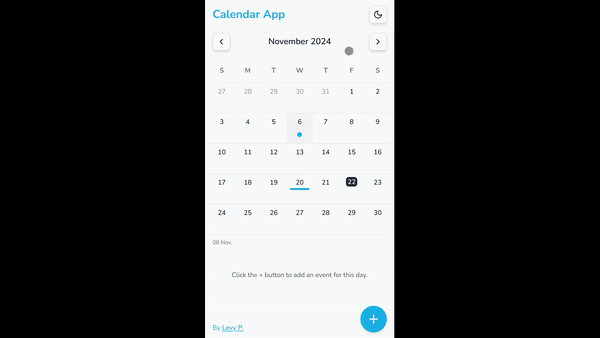

# Calendar App

A responsive and interactive event management application built with **React**, **TailwindCSS**, **Framer Motion**, and **Radix UI Primitives**. This app is designed to provide a seamless user experience for managing daily events with animations and accessibility in mind.

- Live URL: [https://levycalendarwebapp.netlify.app/](https://levycalendarwebapp.netlify.app/)

## 📸 Demo
 

---

## 🌟 Features

### **1. Dark/Light Theme Toggle**
- Detects the user's preferred theme on their first visit and applies it automatically.
- Saves the selected theme in `localStorage` for future visits.
- Fully styled using TailwindCSS's `dark` mode.

---

### **2. Calendar Navigation**
- Navigate through months using "Previous" and "Next" buttons.
- Displays the current month and year dynamically.
- Smooth animations using **Framer Motion**: 
  - Moving forward animates the grid and header from **right to left**.
  - Moving backward animates from **left to right**.

---

### **3. Event Management**
#### Add Events:
- Click the **"+" button** in the bottom-right corner to open the event modal.
- Input fields include:
  - **Title (required)**.
  - **All Day toggle**: When enabled, time inputs are hidden.
  - **Start and End Time**: Auto-adjust if times are reversed.
  - **Repeat Mode**: Select from *Never, Daily, Weekly, Monthly, Yearly* (visual only, no logic implemented).
  - **Notes**: Optional text input.
- Save events to `localStorage`.

#### Edit Events:
- Click on an event to open the modal pre-filled with its details for easy updates.

#### Delete Events:
- Use the **"Remove" button** (circle with an "X") to delete an event.
- A confirmation dialog appears using **Radix UI Alert Dialog** for user safety.

---

### **4. Event List**
- View a list of events for the selected day.
- Displays:
  - **Event Title**.
  - **Duration** (All Day or start and end time).
- Scrollable list with `overflow-y` for days with multiple events.
- If no events are present: `"Click the + button to add an event for this day."`

---

### **5. Accessibility and Responsiveness**
- Fully responsive design (mobile-first approach):
  - The event modal covers the entire screen on smaller devices for better usability.
  - Works seamlessly on large screens and small screens.
- Accessibility-first components using **Radix UI Primitives**.

---

## 🚀 Technologies Used
- **React**: Component-based architecture for building UI.
- **TailwindCSS**: For utility-first and responsive styling.
- **Framer Motion**: Smooth animations for transitions and interactions.
- **Radix UI Primitives**: Accessible UI components (Modal, Dialog, etc.).
- **date-fns**: Handle date calculations and formatting.
